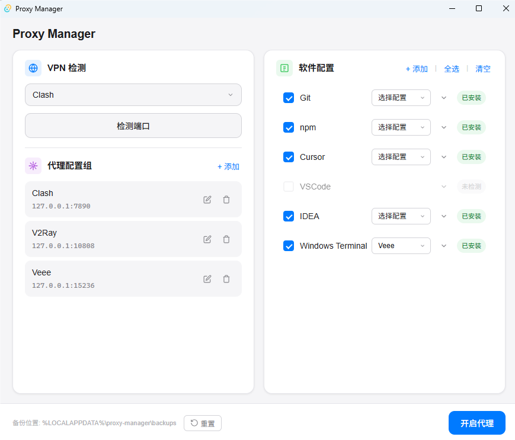

# Proxy Manager

一个跨平台的代理配置管理工具，帮助开发者一键管理各种 CLI/IDE 工具的代理设置。


## 功能特性

- **VPN 端口检测** - 自动检测常见 VPN 软件（Clash、V2Ray、Veee 等）的代理端口
- **多软件支持** - 支持 Git、npm、Cursor、VSCode、IDEA、Windows Terminal 等常用工具
- **代理配置组** - 预设多个代理配置，不同软件可使用不同的代理
- **自定义软件** - 支持添加自定义软件配置（JSON/INI/ENV 格式）
- **配置备份** - 自动备份原始配置，支持一键恢复
- **系统托盘** - 支持最小化到系统托盘后台运行
- **跨平台** - 支持 Windows 和 macOS

## 截图



## 安装

### 下载安装包

前往 [Releases](https://github.com/your-username/proxy-manager/releases) 页面下载对应平台的安装包：

- Windows: `.msi` 或 `.exe`
- macOS: `.dmg`

### 从源码构建

#### 环境要求

- [Node.js](https://nodejs.org/) >= 18
- [Rust](https://www.rust-lang.org/) >= 1.70
- [pnpm](https://pnpm.io/) 或 npm

#### 构建步骤

```bash
# 克隆仓库
git clone https://github.com/your-username/proxy-manager.git
cd proxy-manager

# 安装依赖
npm install

# 开发模式运行
npm run tauri dev

# 构建发布版本
npm run tauri build
```

## 使用说明

### 1. VPN 端口检测

选择你正在使用的 VPN 软件，点击"检测端口"自动获取代理端口。

支持的 VPN：
- Clash (默认端口 7890)
- V2Ray (默认端口 10808)
- Veee (默认端口 15236)
- Shadowsocks (默认端口 1080)
- 其他自定义 VPN

### 2. 代理配置组

创建多个代理配置组，每个配置组包含：
- 名称（如 "Clash"、"公司代理"）
- 主机地址（如 127.0.0.1）
- 端口号（如 7890）

### 3. 软件配置

勾选需要配置代理的软件，为每个软件选择对应的代理配置组。

支持的软件：
| 软件 | 配置格式 | 配置路径 |
|------|----------|----------|
| Git | INI | `~/.gitconfig` |
| npm | INI | `~/.npmrc` |
| Cursor | JSON | `%APPDATA%/Cursor/User/settings.json` |
| VSCode | JSON | `%APPDATA%/Code/User/settings.json` |
| IDEA | XML | `%APPDATA%/JetBrains/IntelliJIdea*/options/proxy.settings.xml` |
| Windows Terminal | JSON | `%LOCALAPPDATA%/Packages/.../settings.json` |

### 4. 自定义软件

点击"+ 添加"可以添加自定义软件配置：
- 软件名称
- 配置文件类型（JSON/INI/ENV）
- 配置文件路径（支持环境变量如 `%USERPROFILE%`）

### 5. 开启/关闭代理

- 点击"开启代理"将代理配置写入选中软件的配置文件
- 点击"关闭代理"移除代理配置
- 点击"重置"恢复到首次使用前的原始配置

### 6. 系统托盘

关闭窗口时可选择：
- 最小化到系统托盘（程序后台运行）
- 退出程序

可勾选"记住我的选择"保存偏好。

## 配置文件位置

- 用户配置：`~/.proxy-manager/user_config.json`
- 备份目录：`%LOCALAPPDATA%/proxy-manager/backups/`

## 技术栈

- **前端**: React 19 + TypeScript + CSS
- **后端**: Rust + Tauri 2.x
- **构建**: Vite

## 项目结构

```
proxy-manager/
├── src/                    # React 前端代码
│   ├── App.tsx            # 主组件
│   └── App.css            # 样式
├── src-tauri/             # Rust 后端代码
│   ├── src/
│   │   ├── lib.rs         # Tauri 命令入口
│   │   ├── config_manager.rs  # 配置文件管理
│   │   ├── port_detector.rs   # 端口检测
│   │   └── profile_manager.rs # 用户配置管理
│   ├── Cargo.toml
│   └── tauri.conf.json
├── package.json
└── README.md
```

## 开发

```bash
# 安装依赖
npm install

# 启动开发服务器
npm run tauri dev

# 类型检查
npm run build

# 构建发布版本
npm run tauri build
```

## 贡献

欢迎提交 Issue 和 Pull Request！

1. Fork 本仓库
2. 创建特性分支 (`git checkout -b feature/amazing-feature`)
3. 提交更改 (`git commit -m 'Add some amazing feature'`)
4. 推送到分支 (`git push origin feature/amazing-feature`)
5. 提交 Pull Request

## 许可证

本项目采用 [MIT](LICENSE) 许可证。

## 致谢

- [Tauri](https://tauri.app/) - 跨平台桌面应用框架
- [React](https://react.dev/) - 用户界面库
